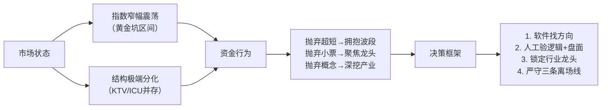

以下是对《AI交易大师内部私享会0525》课程转录内容的专业分析，严格依据原始语音文本（时间戳精确到秒），剔除情绪化表达与重复冗余，聚焦**可验证、可复用、可落地的交易认知与方法论**：

---

### **1. 核心主题**（2–3句概括）  
本节课核心是**在指数窄幅震荡、市场高度结构分化的背景下，识别并参与AI科技主线中的“波段型行业龙头轮动”行情**。主讲人强调：当前并非普涨行情，而是以“千亿市值以上、AI细分领域绝对龙头”为审美标准的结构性抱团，需放弃仓位博弈思维，转向**方向选择＞个股选择＞买卖点执行**的三层决策体系。

---

### **2. 关键观点**（5–8个最重要知识点，每点含解释）

| 序号 | 观点 | 解释 |
|------|------|------|
| **① 市场本质是“两级割裂+结构性抱团”** | 数据印证：涨停103家 vs 跌停15家，但上涨家数仅2180家（下跌3224家），昨日连板晋级率仅18.18%。说明资金高度集中于少数方向，其余板块持续失血，“KTV与ICU并存”。 |
| **② 当前抱团对象已从“AI科技”进化为“AI科技中的AI”** | 不再泛泛炒AI，而是聚焦AI产业链中更上游、更硬核、更具不可替代性的子领域（如PCB、算力芯片、光模块等），且只做其中**千亿市值以上的行业龙头**（如生意、互电、盆顶）。 |
| **③ “波段股”已取代“超短股”成为主力盈利模式** | 提出金律：“**波断不死，超短不来；波断将死，超短寄来**”。当前大容量波段标的（如PCB龙头）涨幅、持续性、容错率均远超传统超短，且逻辑更硬、敢重仓持有。 |
| **④ 行业龙头 ≠ 市场龙头，定义必须清晰** | 行业龙头指**该细分领域A股上市公司中基本面最强、技术壁垒最高、全球份额领先的企业**（如PCB领域的生意科技=全球前三/国内第一；互电=估值更低但产能扩张快），而非单纯看股价弹性或连板高度。 |
| **⑤ 主线确认需“消息+盘面”双验证** | 软件触发信号后，必须人工验证：① 消息是否具备**产业级可持续逻辑**（非概念炒作）；② 盘中是否有**大容量核心标的逆势走强**（尤其在大盘跳水时仍抗跌/领涨）。二者缺一不可。 |
| **⑥ 震荡行情仓位管理核心是“阶段适配”，非机械盯K线** | 明确四阶段模型：当前属“**强势震荡区间**”（窄幅上下沿明确），对应策略是“**六层仓位以内，聚焦主线波段**”。反对因单日阳线加仓、阴线减仓的后视镜操作。 |
| **⑦ 买卖点规则极度简化，重在纪律** | PCB方向离场仅三条铁律：① 板块出现大面积亏钱效应；② 核心标的出现爆量长阴；③ 跌破5日线。**除此以外，拿住不动**——体现对主线强度与龙头韧性的信任。 |
| **⑧ 工具（软件）是信息处理中枢，人是决策终审官** | 软件价值在于：毫秒级扫描全球消息→AI打分筛选→实时匹配强势板块→推送目标股。但人需完成“**消息逻辑验证+盘面强度确认+仓位节奏匹配**”三步终审，不可盲从。 |

---

### **3. 交易洞察：可直接落地的具体策略与规则**

✅ **【可立即执行的策略】**  
- **主线识别流程（每日盘前/盘中）：**  
  1. 打开软件，查看最新推送方向（如9:38分推送“芯片”）；  
  2. 立即核查：① 是否属AI科技范畴？② 是否有重磅产业消息（如华为“掏定律”）？③ 消息是否具全球产业链影响（非局部政策）？  
  3. 观察盘面：该方向是否有**千亿市值龙头**在**大盘跳水时逆势涨停/抗跌**？若有，则确认主线成立。  

- **标的筛选标准（硬性门槛）：**  
  - 市值 ≥ 2000亿；  
  - 属AI科技中**具体细分赛道**（如PCB、存储、光模块、服务器）；  
  - 是该赛道**A股唯一/前三**（生意=全球PCB前三，互电=国内PCB产能龙头）；  
  - 近期未大幅上涨（“还没长起来的核心大票”优先）。  

- **买入与持有规则：**  
  - **买点：** 方向确认后，首只涨停/放量突破5日线的行业龙头（如生意科技周五涨停）；  
  - **仓位：** 单只标的≤3层，主线内最多配置2只（如生意+互电）；  
  - **持有：** 只要满足“无亏钱效应+无爆量阴线+不破5日线”，**无视日内波动，持有至主线衰竭**；  
  - **止盈：** 不设固定目标，以“板块集体滞涨+龙头缩量”为预警信号。  

- **风险控制底线：**  
  - 若当日出现“涨停家数＜50家 & 跌停家数＞30家”，立即暂停所有新开仓；  
  - 任何标的单日亏损达**-7%**，无条件执行软件直损线（例：互电直损线49.9元）。  

---

### **4. 金句**（原话摘录，值得刻入交易系统）

> 🔹 **“盈亏同源——上涨时你敢满仓，下跌时你敢清仓？可能吗？”**  
> *（直击仓位管理本质：一致性比择时更重要）*  

> 🔹 **“波断不死，超短不来；波断将死，超短寄来。”**  
> *（定义当前市场风格切换的底层信号）*  

> 🔹 **“你曾经在这里赚到钱没？就这么简单。”**  
> *（终极仓位决策法则：用历史实盘结果代替主观臆测）*  

---

### 附：课程底层逻辑图谱（供深度复盘）

> ✅ **总结**：本课不是教“如何抓涨停”，而是构建一套**在混沌市中识别确定性主线、用工业化流程过滤噪音、以极简规则驾驭人性弱点**的实战系统。其价值不在“预测”，而在“应对”——当市场给出明确信号时，你知道该信什么、做什么、何时停。

如需进一步提炼成**检查清单（Checklist）** 或 **软件信号响应SOP手册**，我可立即为您生成。